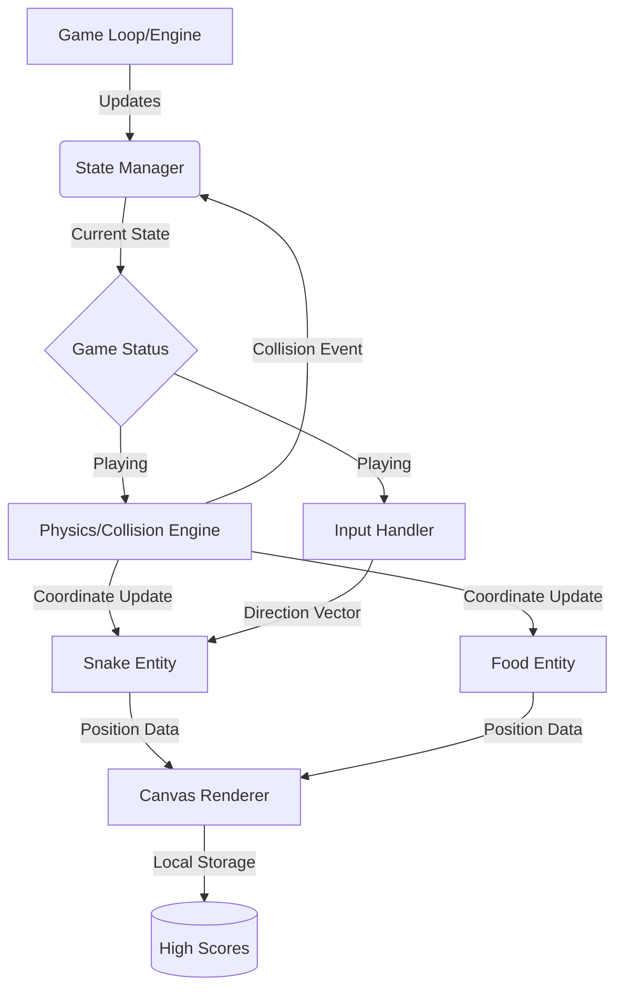

# Cyber-Snake


**Cyber-Snake** is a modernized, high-performance reimagining of the classic Snake arcade game, built with a focus on modular design, retro-futuristic aesthetics, and object-oriented principles. Developed by [ClashLex](https://github.com/ClashLex), this project serves as both an engaging game and a reference implementation for state-driven game development.

---

## 1. Project Overview
Cyber-Snake elevates the traditional 2D grid movement mechanics with a "Cyberpunk" inspired visual layer. The project is designed to be lightweight yet extensible, allowing developers to easily swap out rendering engines or input handlers.

### Key Features
*   **Dynamic Difficulty Scaling:** Snake speed and obstacles evolve as the score increases.
*   **Modular Rendering:** Decoupled game logic from the drawing layer.
*   **State Management:** Robust handling of Game Start, Pause, Playing, and Game Over states.
*   **High-Score Persistence:** Local storage integration to track player progress.
*   **Responsive Input:** Optimized event listening for zero-latency control.

---

## 2. Architecture
The system follows a **Model-View-Controller (MVC)** influenced architecture to ensure separation of concerns.

### Component Descriptions
*   **Game Engine:** The central heartbeat; manages the `requestAnimationFrame` loop and delta-time calculations.
*   **Grid Manager:** Handles the coordinate system, collision detection (walls/self), and entity placement.
*   **Entity Controller:** Manages the Snake (linked-list logic for the body) and the Food (randomized spawn logic).
*   **Renderer:** The visual bridge that translates the logical grid into pixels on the screen.
*   **Input Handler:** A singleton that captures keyboard/touch events and translates them into movement vectors.

---

## 3. Architecture Diagram
The following Mermaid diagram illustrates the interaction between the core components:



---

## 4. Installation

### Prerequisites
*   A modern web browser (Chrome, Firefox, Safari, Edge).
*   (Optional) [Node.js](https://nodejs.org/) if you wish to run a local development server.

### Setup
1.  **Clone the repository:**
    ```bash
    git clone https://github.com/ClashLex/Cyber-snake.git
    cd Cyber-snake
    ```

2.  **Open locally:**
    Simply open the `index.html` file in your browser:
    ```bash
    open index.html
    ```

3.  **Alternative (NPM):**
    If you have `http-server` installed:
    ```bash
    npx http-server .
    ```

---

## 5. Usage

### Controls
| Key | Action |
|-----|--------|
| `W` / `Arrow Up` | Move Up |
| `S` / `Arrow Down` | Move Down |
| `A` / `Arrow Left` | Move Left |
| `D` / `Arrow Right` | Move Right |
| `Space` | Pause / Resume |
| `R` | Reset Game |

### API / Customization
You can modify the game behavior by adjusting the constants in the configuration file (`config.js` or top of `script.js`):

```javascript
// Example Configuration
const SETTINGS = {
    GRID_SIZE: 20,
    INITIAL_SPEED: 100, // ms per tick
    SPEED_INCREMENT: 0.95, // multiplier per food eaten
    COLORS: {
        SNAKE_HEAD: '#00ff41',
        SNAKE_BODY: '#008f11',
        FOOD: '#ff003c'
    }
};
```

---

## 6. Configuration
The game supports environment-specific tuning via global variables:

| Variable | Type | Default | Description |
|----------|------|---------|-------------|
| `CANVAS_ID` | String | `'gameCanvas'` | The ID of the HTML5 canvas element. |
| `DEBUG_MODE` | Boolean | `false` | Enables hit-box outlines and coordinate logging. |
| `UPGRADE_CHANCE` | Float | `0.1` | Probability of "Power-Up" food spawning. |

---

## 7. Contributing
Contributions are what make the open-source community an amazing place to learn, inspire, and create.

1.  **Fork** the Project.
2.  **Create** your Feature Branch (`git checkout -b feature/AmazingFeature`).
3.  **Commit** your Changes (`git commit -m 'Add some AmazingFeature'`).
4.  **Push** to the Branch (`git push origin feature/AmazingFeature`).
5.  **Open** a Pull Request.

**Checklist:**
*   Follow the existing code style (ES6+).
*   Document any new functions or classes.
*   Ensure the game remains playable at 60FPS.

---

## 8. License
Distributed under the **MIT License**. See `LICENSE` for more information.

---

**AutoDoc AI Generated** - *Standardizing Excellence in Documentation*